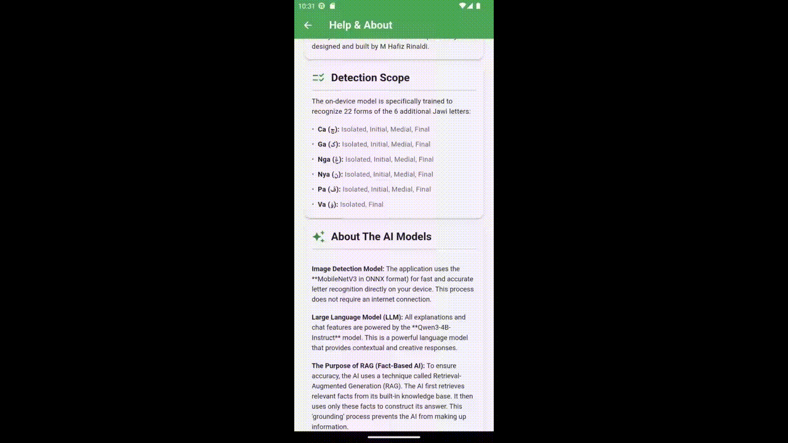
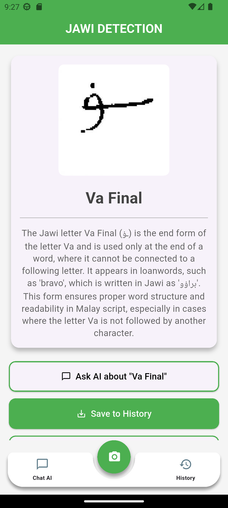
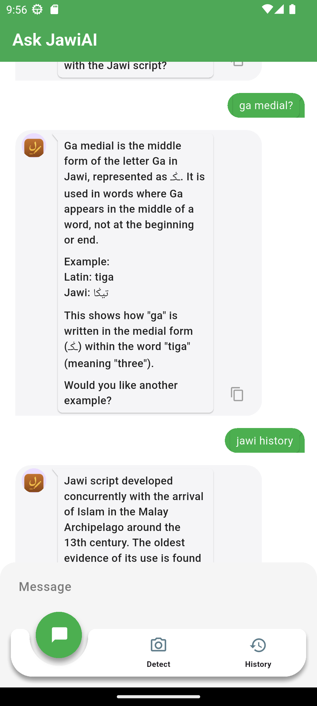
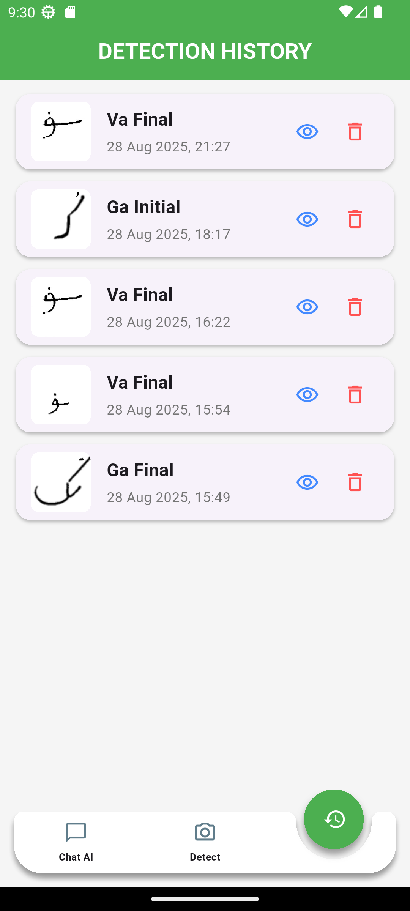
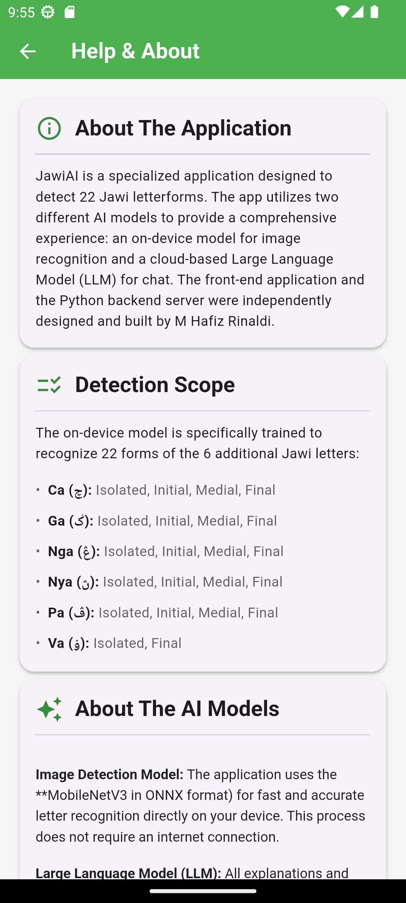
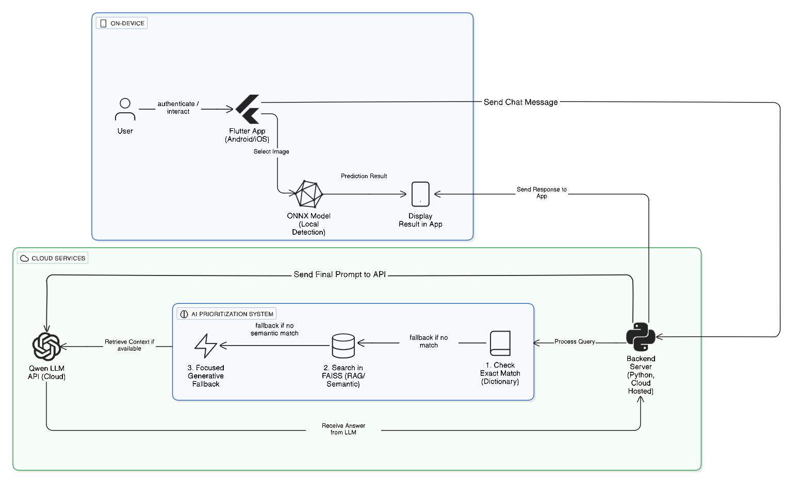

## 💡 Tips for Best Results

> ### Precision vs. Speed: Choose Your Method
>
> **For Maximum Precision (Gallery):**
> When accuracy is your top priority, especially with complex or historical handwriting, using an image from your **gallery** is the recommended approach. It provides the model with a stable, high-quality image for the most reliable analysis.
>
> **For Instant Detection (Camera):**
> For quick, on-the-spot recognition, the **live camera** is a powerful and accurate tool. It excels in real-time analysis, especially in well-lit conditions with a steady hand.

---

# JawiAI: AI-Powered Jawi Script Detection & Tutor

An AI-Powered Mobile Application by **[M Hafiz Rinaldi](https://www.linkedin.com/in/m-hafiz-rinaldi/)**



**JawiAI** is a full-stack andorid mobile application that uses on-device machine learning and a sophisticated cloud-based Large Language Model (LLM) to recognize handwritten Jawi script and provide users with an interactive, AI-powered learning experience.

---
## 🎯 The Problem

The Jawi script is a vital part of Southeast Asian cultural heritage, yet its use has declined, making it difficult for new generations to learn and for researchers to digitize historical manuscripts.A significant barrier to developing digital learning tools is the **scarcity of comprehensive, publicly available datasets** for Jawi characters, which hinders research in Optical Character Recognition (OCR).

---
## 💡 The Solution

JawiAI provides an innovative, two-part solution that combines the best of on-device and cloud AI:

1.  **On-Device Detection:** The mobile app uses a lightweight, pre-trained **MobileNetV3** model in ONNX format for cross-platform performance. This model instantly recognizes 22 different Jawi letterforms from an image, working completely offline.This approach is based on successful methods from academic research, which have achieved up to 96% accuracy in Jawi classification.

2.  **AI-Powered Tutor:** After a letter is identified, the app connects to a sophisticated backend powered by the **Qwen3-4B-Instruct** model. This AI assistant provides:
    * **Accurate Explanations** using a Retrieval-Augmented Generation (RAG) system to ensure all information is fact-based.
    * **Contextual Conversations** with a memory of recent messages to handle follow-up questions intelligently.
    * **Creative Assistance** by switching to a generative mode when asked to create new examples or content.

This hybrid approach provides a fast, accurate, and deeply interactive learning tool designed to make Jawi more accessible.

---

## ✨ Detection Scope (22 Letter Forms)

**Important:** This application is specifically trained to recognize **22 forms** of the 6 unique, additional Jawi letters. This includes the variations of each letter's shape when it is in an isolated, initial, medial, and final position in a word.

<details>
<summary><b>Click to see the full list of 22 supported letter forms</b></summary>
<br>

Here are the complete details:

* **Letter Ca (چ)**
    * Ca Isolated
    * Ca Initial
    * Ca Medial
    * Ca Final
* **Letter Ga (ݢ)**
    * Ga Isolated
    * Ga Initial
    * Ga Medial
    * Ga Final
* **Letter Nga (ڠ)**
    * Nga Isolated
    * Nga Initial
    * Nga Medial
    * Nga Final
* **Letter Nya (ڽ)**
    * Nya Isolated
    * Nya Initial
    * Nya Medial
    * Nya Final
* **Letter Pa (ڤ)**
    * Pa Isolated
    * Pa Initial
    * Pa Medial
    * Pa Final
* **Letter Va (ۏ)**
    * Va Isolated
    * Va Final

*(Total: 4+4+4+4+4+2 = 22 letter forms)*
</details>

---
## ✨ Key Features

| Feature | Description | Screenshot |
| :--- | :--- | :---: |
| **📷 Image Detection** | Instantly identify Jawi letters using your phone's camera or gallery. The AI provides a quick, fact-based summary. |  |
| **🧠 Smart AI Chat** | Engage in a conversation with an AI that has a deep, factual understanding of the Jawi script and remembers the context of your chat. |  |
| **💾 Save to History** | Save interesting detection results, including the image and AI description, to a local database on your device for later review. |  |
| **📖 In-App Guide** | A comprehensive help screen explains the app's features, the AI technology behind it, and how to use it effectively. |  |

---
## 🛠️ Technology Stack & Architecture

This project is a full-stack application leveraging modern technologies for both the mobile client and the AI backend.

### **System Architecture**

 

### **Tech Stack**

* **Frontend (Mobile App)**:
    * **Framework**: Flutter & Dart
    * **On-Device ML**: `flutter_onnxruntime`
    * **Networking**: `http`
    * **Local Storage**: `sqflite`
* **Backend (Server)**:
    * **Framework**: Python & Flask
    * **AI Logic**:
        * `sentence-transformers`: For creating vector embeddings.
        * `faiss-cpu`: For high-speed similarity search (RAG).
* **AI Models**:
    * **Image Detection**: MobileNetV3 (Self-trained, ONNX Format)
    * **Language Model**: Qwen3-4B-Instruct-2507
    * 

### ⚙️ Technical Methodology Details

#### 1. Hybrid Retrieval-Augmented Generation (RAG) [Backend]
This system is the brain behind the JawiAI chat feature, designed to ensure factual answers and prevent hallucination. Its workflow is prioritized for maximum accuracy and efficiency:

* **Priority #1: Exact Match**
    * The system first checks if a query exactly matches a core Jawi term in a pre-computed dictionary (`document_lookup`).
    * **Result:** This provides an instant response with 100% accuracy for the most common questions.

* **Priority #2: Semantic Search (Vector Search)**
    * If no exact match is found, the query is converted into a vector and searched against a FAISS vector database to find the most semantically relevant document.
    * A relevance filter (`RELEVANCE_THRESHOLD`) is used to discard results that are not similar enough.

* **Priority #3: Grounded Generation**
    * The retrieved context (from step 1 or 2) is injected into a prompt that strictly instructs the LLM to answer **ONLY** based on the provided information.

* **Priority #4: Guarded Fallback**
    * If no relevant context is found, the system uses a "guardrail" prompt that directs the AI to stay on the topic of Jawi, preventing off-topic or irrelevant answers.

#### 2. On-Device Image Recognition [Frontend]
The image detection feature runs entirely offline on the user's device for instant results.

* **Model:** Uses a Deep Learning model (MobileNetV3/EfficientNet) converted to the efficient **ONNX** format.
* **Process:**
    1.  **Preprocessing:** The image is resized to 224x224 and normalized.
    2.  **Inference:** The processed image is run through the ONNX model using the `flutter_onnxruntime` library.
    3.  **Post-processing:** A *softmax* function is applied to the model's output to get the prediction with the highest probability.

---
## 🚀 Getting Started

There are two ways to run this application: the easy way (using the hosted backend and pre-built APK) or the manual way (running everything locally).

### **Option 1: The Easy Way (Recommended for Reviewers)**
The backend is publicly hosted on Hugging Face Spaces, and a pre-built APK is available for easy installation on an Android device.

**1. Install the App:**
* Download the latest `JawiAI.apk` from the **[GitHub Releases page](https://github.com/HafizRinaldi/jawi-app/releases/latest)**.

**2. Run the App:**
* Simply install the APK on your Android device. The application is already configured to connect to the hosted backend. No further steps are needed!

The backend is running live at:
**[https://Manok45-jawi-backendv2.hf.space](https://Manok45-jawi-backendv2.hf.space)**

<br>

### **Option 2: The Manual Way (For Developers)**

<details>
<summary><b>Click to view instructions for running the backend and frontend locally</b></summary>
<br>

#### **A. Backend Setup (Python)**
The backend server handles all AI chat logic.

**Prerequisites:**
* Python 3.8+
* `pip` (Python package installer)

**Installation:**

1.  **Clone the repository:**
    ```bash
    git clone https://github.com/HafizRinaldi/jawi-app.git
    cd jawi-app/backend
    ```

2.  **Create a virtual environment (recommended):**
    ```bash
    python -m venv venv
    venv\Scripts\activate  # On Windows
    ```

3.  **Install dependencies from `requirements.txt`:**
    ```bash
    pip install -r requirements.txt
    ```

4.  **Set up environment variables:**
    * Create a file named `.env` in the `backend` folder.
    * Open the `.env` file and add your Qwen API Key:
        ```
        QWEN_API_KEY="sk-YourSecretAPIKeyGoesHere"
        ```

5.  **Run the data ingestion script:**
    * This script needs to be run only once to build the FAISS vector database.
    ```bash
    python ingest.py
    ```

6.  **Run the Flask server:**
    ```bash
    flask run --host=0.0.0.0
    ```
    The server is now running on your local network. Note down your local IP address.

#### **B. Frontend Setup (Flutter)**
The frontend is the mobile application.

**Prerequisites:**
* Flutter SDK
* An editor like VS Code or Android Studio
* A connected device or emulator

**Installation:**

1.  **Navigate to the frontend directory:**
    ```bash
    cd ../frontend # Assuming you are in the backend folder
    ```

2.  **Get Flutter packages:**
    ```bash
    flutter pub get
    ```

3.  **Update the backend IP address (if running backend locally):**
    * Open the file `lib/services/chat_api_service.dart`.
    * Change the `_baseUrl` to match the local IP address of the computer running your Python backend.
        ```dart
        // lib/services/chat_api_service.dart
        static const String _baseUrl = 'http://192.168.1.4:5000'; // Change this IP
        ```

4.  **Run the application:**
    ```bash
    flutter run
    ```
</details>

---
## 👨‍💻 Project Author

This entire project, including the **Flutter application**, the **Python backend server**, the **data augmentation process**, and the training of the **MobileNetV3 detection model**, was independently designed and built by **M Hafiz Rinaldi** as part of a technical assessment.
